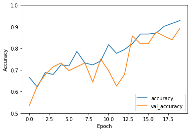
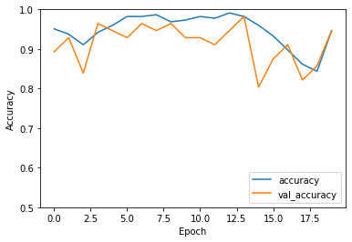

# gesture-recognition
Dataset used: Microsoft Kinect and Leap Motion Dataset, https://lttm.dei.unipd.it/downloads/gesture/#kinect_leap <br>

Approach 1, results, branch *first-step-fix*:

```
In [92]: history = model.fit(X_train, Y_train, epochs=20, validation_data=(X_test, Y_test))
Epoch 1/20
7/7 ━━━━━━━━━━━━━━━━━━━━ 7s 1s/step - accuracy: 0.5672 - loss: 0.6807 - val_accuracy: 0.5179 - val_loss: 0.6897
Epoch 2/20
7/7 ━━━━━━━━━━━━━━━━━━━━ 8s 965ms/step - accuracy: 0.5662 - loss: 0.6824 - val_accuracy: 0.5536 - val_loss: 0.6850
Epoch 3/20
7/7 ━━━━━━━━━━━━━━━━━━━━ 6s 884ms/step - accuracy: 0.5392 - loss: 0.6707 - val_accuracy: 0.5357 - val_loss: 0.6815
Epoch 4/20
7/7 ━━━━━━━━━━━━━━━━━━━━ 6s 860ms/step - accuracy: 0.5624 - loss: 0.6547 - val_accuracy: 0.5714 - val_loss: 0.7195
Epoch 5/20
7/7 ━━━━━━━━━━━━━━━━━━━━ 6s 791ms/step - accuracy: 0.5682 - loss: 0.6613 - val_accuracy: 0.5893 - val_loss: 0.6991
Epoch 6/20
7/7 ━━━━━━━━━━━━━━━━━━━━ 6s 817ms/step - accuracy: 0.6506 - loss: 0.6302 - val_accuracy: 0.5893 - val_loss: 0.6664
Epoch 7/20
7/7 ━━━━━━━━━━━━━━━━━━━━ 6s 837ms/step - accuracy: 0.6363 - loss: 0.6357 - val_accuracy: 0.4643 - val_loss: 0.7343
Epoch 8/20
7/7 ━━━━━━━━━━━━━━━━━━━━ 6s 786ms/step - accuracy: 0.5436 - loss: 0.6851 - val_accuracy: 0.5893 - val_loss: 0.6711
Epoch 9/20
7/7 ━━━━━━━━━━━━━━━━━━━━ 6s 820ms/step - accuracy: 0.6360 - loss: 0.6464 - val_accuracy: 0.5179 - val_loss: 0.7142
Epoch 10/20
7/7 ━━━━━━━━━━━━━━━━━━━━ 6s 795ms/step - accuracy: 0.6682 - loss: 0.6464 - val_accuracy: 0.5179 - val_loss: 0.6842
Epoch 11/20
7/7 ━━━━━━━━━━━━━━━━━━━━ 6s 797ms/step - accuracy: 0.6497 - loss: 0.6174 - val_accuracy: 0.5536 - val_loss: 0.6214
Epoch 12/20
7/7 ━━━━━━━━━━━━━━━━━━━━ 6s 785ms/step - accuracy: 0.7285 - loss: 0.5780 - val_accuracy: 0.5714 - val_loss: 0.6544
Epoch 13/20
7/7 ━━━━━━━━━━━━━━━━━━━━ 6s 780ms/step - accuracy: 0.7088 - loss: 0.5466 - val_accuracy: 0.6786 - val_loss: 0.5623
Epoch 14/20
7/7 ━━━━━━━━━━━━━━━━━━━━ 5s 784ms/step - accuracy: 0.7165 - loss: 0.5446 - val_accuracy: 0.7143 - val_loss: 0.5335
Epoch 15/20
7/7 ━━━━━━━━━━━━━━━━━━━━ 5s 776ms/step - accuracy: 0.7828 - loss: 0.4933 - val_accuracy: 0.6607 - val_loss: 0.5391
Epoch 16/20
7/7 ━━━━━━━━━━━━━━━━━━━━ 5s 778ms/step - accuracy: 0.7523 - loss: 0.5059 - val_accuracy: 0.7679 - val_loss: 0.4412
Epoch 17/20
7/7 ━━━━━━━━━━━━━━━━━━━━ 6s 842ms/step - accuracy: 0.7887 - loss: 0.4322 - val_accuracy: 0.7143 - val_loss: 0.5396
Epoch 18/20
7/7 ━━━━━━━━━━━━━━━━━━━━ 6s 800ms/step - accuracy: 0.8093 - loss: 0.3934 - val_accuracy: 0.8214 - val_loss: 0.3887
Epoch 19/20
7/7 ━━━━━━━━━━━━━━━━━━━━ 6s 776ms/step - accuracy: 0.8135 - loss: 0.3816 - val_accuracy: 0.8214 - val_loss: 0.4255
Epoch 20/20
7/7 ━━━━━━━━━━━━━━━━━━━━ 6s 801ms/step - accuracy: 0.8125 - loss: 0.3762 - val_accuracy: 0.8571 - val_loss: 0.3385
```

Graph:


## Update July 7, 2024


Након што сам покренула тренирање добила сам другачије и лошије резултате иако у коду нисам ништа мењала. Код са којим сам добила лошије резултате - 
1965e79 (branch: real-time-images)
```
Epoch 1/20
7/7 ━━━━━━━━━━━━━━━━━━━━ 8s 789ms/step - accuracy: 0.4134 - loss: 0.8141 - val_accuracy: 0.5179 - val_loss: 0.7053
Epoch 2/20
7/7 ━━━━━━━━━━━━━━━━━━━━ 5s 699ms/step - accuracy: 0.5213 - loss: 0.7000 - val_accuracy: 0.4821 - val_loss: 0.7003
Epoch 3/20
7/7 ━━━━━━━━━━━━━━━━━━━━ 5s 697ms/step - accuracy: 0.5154 - loss: 0.6922 - val_accuracy: 0.5179 - val_loss: 0.6907
Epoch 4/20
7/7 ━━━━━━━━━━━━━━━━━━━━ 5s 701ms/step - accuracy: 0.5043 - loss: 0.6948 - val_accuracy: 0.4821 - val_loss: 0.6933
Epoch 5/20
7/7 ━━━━━━━━━━━━━━━━━━━━ 5s 681ms/step - accuracy: 0.5049 - loss: 0.6922 - val_accuracy: 0.4821 - val_loss: 0.6980
Epoch 6/20
7/7 ━━━━━━━━━━━━━━━━━━━━ 5s 680ms/step - accuracy: 0.4945 - loss: 0.6954 - val_accuracy: 0.6071 - val_loss: 0.6897
Epoch 7/20
7/7 ━━━━━━━━━━━━━━━━━━━━ 5s 683ms/step - accuracy: 0.5768 - loss: 0.6910 - val_accuracy: 0.6071 - val_loss: 0.6891
Epoch 8/20
7/7 ━━━━━━━━━━━━━━━━━━━━ 5s 682ms/step - accuracy: 0.5513 - loss: 0.6900 - val_accuracy: 0.5536 - val_loss: 0.6897
Epoch 9/20
7/7 ━━━━━━━━━━━━━━━━━━━━ 5s 678ms/step - accuracy: 0.5387 - loss: 0.6881 - val_accuracy: 0.5536 - val_loss: 0.6888
Epoch 10/20
7/7 ━━━━━━━━━━━━━━━━━━━━ 5s 674ms/step - accuracy: 0.5644 - loss: 0.6847 - val_accuracy: 0.6250 - val_loss: 0.6835
Epoch 11/20
7/7 ━━━━━━━━━━━━━━━━━━━━ 5s 681ms/step - accuracy: 0.5812 - loss: 0.6845 - val_accuracy: 0.6071 - val_loss: 0.6821
Epoch 12/20
7/7 ━━━━━━━━━━━━━━━━━━━━ 5s 684ms/step - accuracy: 0.6137 - loss: 0.6748 - val_accuracy: 0.5893 - val_loss: 0.6708
Epoch 13/20
7/7 ━━━━━━━━━━━━━━━━━━━━ 5s 679ms/step - accuracy: 0.6526 - loss: 0.6653 - val_accuracy: 0.5536 - val_loss: 0.6581
Epoch 14/20
7/7 ━━━━━━━━━━━━━━━━━━━━ 5s 693ms/step - accuracy: 0.6661 - loss: 0.6584 - val_accuracy: 0.5179 - val_loss: 0.6976
Epoch 15/20
7/7 ━━━━━━━━━━━━━━━━━━━━ 5s 681ms/step - accuracy: 0.5801 - loss: 0.6715 - val_accuracy: 0.5179 - val_loss: 0.7169
Epoch 16/20
7/7 ━━━━━━━━━━━━━━━━━━━━ 5s 690ms/step - accuracy: 0.5555 - loss: 0.6942 - val_accuracy: 0.4821 - val_loss: 0.7493
Epoch 17/20
7/7 ━━━━━━━━━━━━━━━━━━━━ 5s 725ms/step - accuracy: 0.5013 - loss: 0.7234 - val_accuracy: 0.6071 - val_loss: 0.6812
Epoch 18/20
7/7 ━━━━━━━━━━━━━━━━━━━━ 5s 720ms/step - accuracy: 0.6212 - loss: 0.6768 - val_accuracy: 0.5000 - val_loss: 0.7441
Epoch 19/20
7/7 ━━━━━━━━━━━━━━━━━━━━ 6s 803ms/step - accuracy: 0.5328 - loss: 0.7111 - val_accuracy: 0.6071 - val_loss: 0.6690
Epoch 20/20
7/7 ━━━━━━━━━━━━━━━━━━━━ 6s 780ms/step - accuracy: 0.6226 - loss: 0.6605 - val_accuracy: 0.5357 - val_loss: 0.6648
2/2 - 0s - 63ms/step - accuracy: 0.5357 - loss: 0.6648
0.5357142686843872
```


### Друго покретање model.fit() у истој конзоли, ништа није мењано:

```
Epoch 1/20
7/7 ━━━━━━━━━━━━━━━━━━━━ 5s 692ms/step - accuracy: 0.6436 - loss: 0.6422 - val_accuracy: 0.5357 - val_loss: 0.6545
Epoch 2/20
7/7 ━━━━━━━━━━━━━━━━━━━━ 5s 714ms/step - accuracy: 0.6401 - loss: 0.6083 - val_accuracy: 0.6250 - val_loss: 0.6311
Epoch 3/20
7/7 ━━━━━━━━━━━━━━━━━━━━ 5s 680ms/step - accuracy: 0.7064 - loss: 0.5943 - val_accuracy: 0.6786 - val_loss: 0.6058
Epoch 4/20
7/7 ━━━━━━━━━━━━━━━━━━━━ 5s 697ms/step - accuracy: 0.6721 - loss: 0.5447 - val_accuracy: 0.7143 - val_loss: 0.5837
Epoch 5/20
7/7 ━━━━━━━━━━━━━━━━━━━━ 5s 660ms/step - accuracy: 0.7361 - loss: 0.5603 - val_accuracy: 0.7321 - val_loss: 0.6143
Epoch 6/20
7/7 ━━━━━━━━━━━━━━━━━━━━ 5s 668ms/step - accuracy: 0.7269 - loss: 0.5485 - val_accuracy: 0.6964 - val_loss: 0.5392
Epoch 7/20
7/7 ━━━━━━━━━━━━━━━━━━━━ 5s 678ms/step - accuracy: 0.8076 - loss: 0.4423 - val_accuracy: 0.7143 - val_loss: 0.5245
Epoch 8/20
7/7 ━━━━━━━━━━━━━━━━━━━━ 5s 699ms/step - accuracy: 0.7341 - loss: 0.4704 - val_accuracy: 0.7321 - val_loss: 0.4851
Epoch 9/20
7/7 ━━━━━━━━━━━━━━━━━━━━ 5s 735ms/step - accuracy: 0.7247 - loss: 0.4640 - val_accuracy: 0.6429 - val_loss: 0.5910
Epoch 10/20
7/7 ━━━━━━━━━━━━━━━━━━━━ 5s 768ms/step - accuracy: 0.7537 - loss: 0.4937 - val_accuracy: 0.7500 - val_loss: 0.4983
Epoch 11/20
7/7 ━━━━━━━━━━━━━━━━━━━━ 5s 782ms/step - accuracy: 0.8492 - loss: 0.3881 - val_accuracy: 0.6964 - val_loss: 0.5324
Epoch 12/20
7/7 ━━━━━━━━━━━━━━━━━━━━ 6s 810ms/step - accuracy: 0.7689 - loss: 0.4424 - val_accuracy: 0.6250 - val_loss: 0.6844
Epoch 13/20
7/7 ━━━━━━━━━━━━━━━━━━━━ 6s 778ms/step - accuracy: 0.7300 - loss: 0.4737 - val_accuracy: 0.6786 - val_loss: 0.4503
Epoch 14/20
7/7 ━━━━━━━━━━━━━━━━━━━━ 5s 783ms/step - accuracy: 0.8139 - loss: 0.3565 - val_accuracy: 0.8571 - val_loss: 0.4217
Epoch 15/20
7/7 ━━━━━━━━━━━━━━━━━━━━ 5s 775ms/step - accuracy: 0.8698 - loss: 0.3080 - val_accuracy: 0.8214 - val_loss: 0.4015
Epoch 16/20
7/7 ━━━━━━━━━━━━━━━━━━━━ 5s 773ms/step - accuracy: 0.8937 - loss: 0.2629 - val_accuracy: 0.8214 - val_loss: 0.4034
Epoch 17/20
7/7 ━━━━━━━━━━━━━━━━━━━━ 5s 773ms/step - accuracy: 0.8659 - loss: 0.2619 - val_accuracy: 0.8750 - val_loss: 0.3169
Epoch 18/20
7/7 ━━━━━━━━━━━━━━━━━━━━ 5s 772ms/step - accuracy: 0.9142 - loss: 0.2347 - val_accuracy: 0.8571 - val_loss: 0.3878
Epoch 19/20
7/7 ━━━━━━━━━━━━━━━━━━━━ 6s 785ms/step - accuracy: 0.8967 - loss: 0.2393 - val_accuracy: 0.8393 - val_loss: 0.3491
Epoch 20/20
7/7 ━━━━━━━━━━━━━━━━━━━━ 6s 808ms/step - accuracy: 0.9267 - loss: 0.1809 - val_accuracy: 0.8929 - val_loss: 0.2949
```

```
2/2 - 0s - 33ms/step - accuracy: 0.8929 - loss: 0.2949
0.8928571343421936
```



### Треће покретање model.fit() у истој конзоли, ништа није мењано:

- saved in model.h5 (1965e79)

```
Epoch 1/20
7/7 ━━━━━━━━━━━━━━━━━━━━ 5s 689ms/step - accuracy: 0.9468 - loss: 0.1507 - val_accuracy: 0.8929 - val_loss: 0.2569
Epoch 2/20
7/7 ━━━━━━━━━━━━━━━━━━━━ 5s 670ms/step - accuracy: 0.9314 - loss: 0.1528 - val_accuracy: 0.9286 - val_loss: 0.2370
Epoch 3/20
7/7 ━━━━━━━━━━━━━━━━━━━━ 5s 668ms/step - accuracy: 0.9330 - loss: 0.1747 - val_accuracy: 0.8393 - val_loss: 0.3639
Epoch 4/20
7/7 ━━━━━━━━━━━━━━━━━━━━ 5s 674ms/step - accuracy: 0.9324 - loss: 0.2052 - val_accuracy: 0.9643 - val_loss: 0.2236
Epoch 5/20
7/7 ━━━━━━━━━━━━━━━━━━━━ 5s 680ms/step - accuracy: 0.9749 - loss: 0.1013 - val_accuracy: 0.9464 - val_loss: 0.2215
Epoch 6/20
7/7 ━━━━━━━━━━━━━━━━━━━━ 5s 680ms/step - accuracy: 0.9798 - loss: 0.1111 - val_accuracy: 0.9286 - val_loss: 0.2898
Epoch 7/20
7/7 ━━━━━━━━━━━━━━━━━━━━ 5s 736ms/step - accuracy: 0.9818 - loss: 0.0965 - val_accuracy: 0.9643 - val_loss: 0.1737
Epoch 8/20
7/7 ━━━━━━━━━━━━━━━━━━━━ 5s 707ms/step - accuracy: 0.9679 - loss: 0.0978 - val_accuracy: 0.9464 - val_loss: 0.2387
Epoch 9/20
7/7 ━━━━━━━━━━━━━━━━━━━━ 5s 724ms/step - accuracy: 0.9688 - loss: 0.0976 - val_accuracy: 0.9643 - val_loss: 0.1537
Epoch 10/20
7/7 ━━━━━━━━━━━━━━━━━━━━ 5s 775ms/step - accuracy: 0.9713 - loss: 0.0909 - val_accuracy: 0.9286 - val_loss: 0.2683
Epoch 11/20
7/7 ━━━━━━━━━━━━━━━━━━━━ 6s 830ms/step - accuracy: 0.9847 - loss: 0.0532 - val_accuracy: 0.9286 - val_loss: 0.2473
Epoch 12/20
7/7 ━━━━━━━━━━━━━━━━━━━━ 6s 798ms/step - accuracy: 0.9708 - loss: 0.0681 - val_accuracy: 0.9107 - val_loss: 0.2620
Epoch 13/20
7/7 ━━━━━━━━━━━━━━━━━━━━ 5s 778ms/step - accuracy: 0.9949 - loss: 0.0433 - val_accuracy: 0.9464 - val_loss: 0.1650
Epoch 14/20
7/7 ━━━━━━━━━━━━━━━━━━━━ 6s 813ms/step - accuracy: 0.9883 - loss: 0.0379 - val_accuracy: 0.9821 - val_loss: 0.2217
Epoch 15/20
7/7 ━━━━━━━━━━━━━━━━━━━━ 6s 783ms/step - accuracy: 0.9705 - loss: 0.0781 - val_accuracy: 0.8036 - val_loss: 0.4300
Epoch 16/20
7/7 ━━━━━━━━━━━━━━━━━━━━ 6s 789ms/step - accuracy: 0.9234 - loss: 0.1401 - val_accuracy: 0.8750 - val_loss: 0.3513
Epoch 17/20
7/7 ━━━━━━━━━━━━━━━━━━━━ 6s 787ms/step - accuracy: 0.8858 - loss: 0.2698 - val_accuracy: 0.9107 - val_loss: 0.3392
Epoch 18/20
7/7 ━━━━━━━━━━━━━━━━━━━━ 5s 776ms/step - accuracy: 0.8840 - loss: 0.3819 - val_accuracy: 0.8214 - val_loss: 0.3464
Epoch 19/20
7/7 ━━━━━━━━━━━━━━━━━━━━ 5s 767ms/step - accuracy: 0.8568 - loss: 0.3284 - val_accuracy: 0.8571 - val_loss: 0.2835
Epoch 20/20
7/7 ━━━━━━━━━━━━━━━━━━━━ 5s 776ms/step - accuracy: 0.9041 - loss: 0.1676 - val_accuracy: 0.9464 - val_loss: 0.1941
```
```
2/2 - 0s - 31ms/step - accuracy: 0.9464 - loss: 0.1941
0.9464285969734192
```



```
Model: "sequential_1"
┌─────────────────────────────────┬────────────────────────┬───────────────┐
│ Layer (type)                    │ Output Shape           │       Param # │
├─────────────────────────────────┼────────────────────────┼───────────────┤
│ conv2d_3 (Conv2D)               │ (None, 1, 480, 32)     │     1,003,552 │
├─────────────────────────────────┼────────────────────────┼───────────────┤
│ max_pooling2d_3 (MaxPooling2D)  │ (None, 1, 240, 32)     │             0 │
├─────────────────────────────────┼────────────────────────┼───────────────┤
│ max_pooling2d_4 (MaxPooling2D)  │ (None, 1, 120, 32)     │             0 │
├─────────────────────────────────┼────────────────────────┼───────────────┤
│ conv2d_4 (Conv2D)               │ (None, 1, 120, 64)     │        18,496 │
├─────────────────────────────────┼────────────────────────┼───────────────┤
│ max_pooling2d_5 (MaxPooling2D)  │ (None, 1, 60, 64)      │             0 │
├─────────────────────────────────┼────────────────────────┼───────────────┤
│ conv2d_5 (Conv2D)               │ (None, 1, 60, 64)      │        36,928 │
├─────────────────────────────────┼────────────────────────┼───────────────┤
│ flatten_1 (Flatten)             │ (None, 3840)           │             0 │
├─────────────────────────────────┼────────────────────────┼───────────────┤
│ dense_2 (Dense)                 │ (None, 64)             │       245,824 │
├─────────────────────────────────┼────────────────────────┼───────────────┤
│ dense_3 (Dense)                 │ (None, 2)              │           130 │
└─────────────────────────────────┴────────────────────────┴───────────────┘
 Total params: 1,304,930 (4.98 MB)
 Trainable params: 1,304,930 (4.98 MB)
 Non-trainable params: 0 (0.00 B)
```